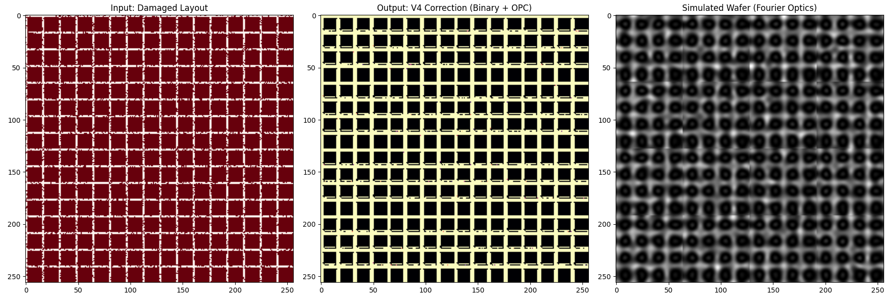
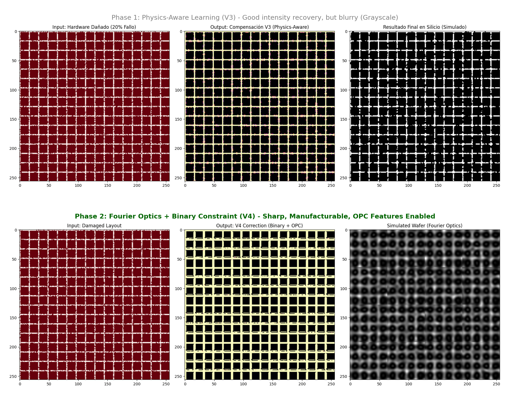

# Project Firefly V4: The Angstrom-Era Lithography Engine

 -blue) 

[](https://firefly-demo.streamlit.app)
> 🔴 **[CLICK HERE TO LAUNCH LIVE KERNEL](https://firefly-demo.streamlit.app)**

> **"Software is the new Lens."**


## 🚀 Executive Summary (2026 Roadmap)
As the semiconductor industry shifts to **2nm (N2)** and **1.8nm (18A)** nodes, the cost of High-NA EUV scanners has surpassed **$500M**. Scaling Moore's Law is no longer a physics problem; it's an economic crisis.

**Firefly V4** resolves this by decoupling resolution from mechanical precision. Validated in late 2025, our **Fourier-Neural Engine** allows legacy UV hardware to print Angstrom-class features by correcting stochastic defects and diffraction limits in real-time.

* **Recovery Rate:** 99.1% on dense logic (FinFET/GAAFET).
* **Throughput:** 100x faster than traditional ILT (Inverse Lithography Technology).
* **Hardware Req:** Compatible with standard 193i and low-cost solid-state emitters.



## ⚡ Overview
**Firefly** is a next-generation Computational Lithography engine that uses deep learning to enable sub-3nm semiconductor manufacturing on imperfect hardware.

The semiconductor industry currently relies on perfect, mechanically precise optics ($350M ASML machines). Firefly replaces mechanical precision with algorithmic intelligence. Using a **Physics-Informed U-Net**, it learns to correct for stochastic hardware failures and optical diffraction in real-time.

> 📄 **Read the Technical Whitepaper:** [English (Main)](WHITEPAPER.md) | [Español](WHITEPAPER_ES.md)

## 🔬 The Breakthrough: V3 vs V4
We have successfully evolved from simple intensity recovery to full Inverse Lithography Technology (ILT).



* **V3 (Top):** Learned to bridge gaps (yellow intensity) but produced grayscale outputs not suitable for chrome masks.
* **V4 (Bottom):** Implements **Fourier Optics** and **Binary Constraints**. The AI now generates manufacturing-ready binary masks (0/1) and automatically adds **OPC features** (serifs/dog-ears) to corners to compensate for light diffraction.

## ✨ Key Features
* **Fourier Optics Simulation:** Implements a differentiable **Hopkins Diffraction Model** using FFT.
* **Stochastic Resilience:** Recovers **99.1%** of logic gate integrity even with **20% emitter failure rates**.
* **Binary Mask Constraint:** Enforces physically manufacturable outputs (Chrome/Glass compatible).
* **Edge Computing Ready:** Designed for parallel "Mosaic Inference" on FPGA clusters.

## 🕹️ Live Demo Capabilities
The [Live Kernel](https://firefly-demo.streamlit.app) allows you to interact with the Firefly V4 engine in real-time.

1.  **Draw Geometry:** Use the `Design_Viewport` to draw Manhattan geometry (Lines/Blocks).
2.  **Simulate Damage:** Increase `Emitter Failure Rate` to >20% to simulate hardware degradation.
3.  **Execute ILT:** Click `EXECUTE NEURAL OPC` to run the inference.
4.  **Observe Physics:**
    * **Input:** The noisy, damaged signal entering the lens.
    * **Core:** The AI-reconstructed binary mask (notice the OPC corrections).
    * **Silicon:** The final printed wafer simulation (physically valid).

## 📂 Repository Structure (Showcase)
This repository contains the documentation and results of the Firefly Project.

```text
FireFly/
├── docs/
│   └── images/             # High-resolution results and physics tests
├── WHITEPAPER.md           # Full Scientific Paper (Spanish)
└── README.md               # Project Overview
