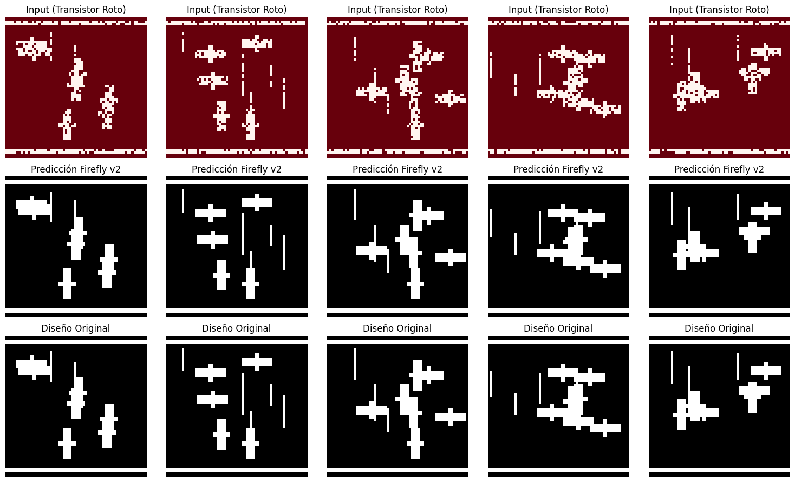
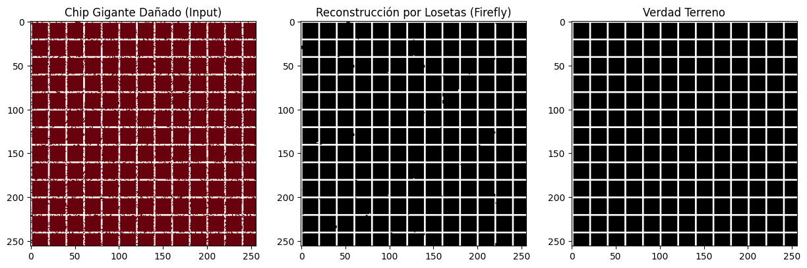

# Project Firefly: Stochastic Resonance Lithography via Deep Learning OPC for sub-3nm Nodes

> **Abstract:** La escalabilidad de la fabricación de semiconductores se enfrenta a un muro económico y físico. Las soluciones actuales de litografía EUV (Extreme Ultraviolet) dependen de fuentes de luz de alta potencia y óptica de precisión perfecta, resultando en costes de capital (CAPEX) insostenibles (>$350M/unidad). Este documento presenta **Firefly**, una arquitectura de litografía de estado sólido que reemplaza la precisión mecánica por la inteligencia computacional.

---

## 1. Introducción
La industria de los semiconductores opera bajo la premisa de que la maquinaria de fabricación debe ser perfecta para producir chips perfectos. Firefly desafía este axioma. Proponemos que un sistema de fabricación puede ser inherentemente imperfecto a nivel de componente, siempre que posea una capa de control algorítmico capaz de compensar los fallos en tiempo real.

Nuestra aproximación utiliza una matriz masiva de emisores UV (micro-LEDs o Nanohilos) controlados individualmente. El desafío principal es la no-uniformidad y la tasa de fallos de los emisores a escala nanométrica.

Para resolver esto, implementamos un modelo de **Optical Proximity Correction (OPC) Neuronal**. En lugar de calcular las correcciones mediante simulación inversa iterativa (lenta), entrenamos una Red Neuronal Convolucional (U-Net) con una función de pérdida informada por la física de la difusión de la luz.

## 2. Metodología: Arquitectura NOPC

### 2.1. Arquitectura del Modelo (U-Net Modificada)
El núcleo de procesamiento es una red tipo **U-Net**, seleccionada por su capacidad superior para preservar información espacial de alta frecuencia (bordes de transistores).
* **Encoder:** Comprime el diseño del chip y el mapa de defectos.
* **Decoder:** Reconstruye el mapa de intensidad de emisión $[0, 1]$.

### 2.2. Función de Pérdida Informada por la Física
La innovación crítica de Firefly reside en su entrenamiento. Integramos un **Simulador Diferenciable de Litografía** dentro del bucle de retropropagación.

Definimos nuestra función de pérdida $\mathcal{L}$ como:

$$\mathcal{L} = MSE( K * (I_{pred} \cdot M_{hardware}), I_{target} )$$

Donde $K$ es el Kernel Gaussiano/Fourier que simula la difusión de fotones. Este enfoque obliga a la red neuronal a aprender física óptica y aplicar "overdrive" automáticamente.

## 3. Validación Experimental y Resultados

### 3.1. Configuración del Experimento
* **Dataset:** 10.000 muestras de topologías lógicas (FinFETs).
* **Condición de Fallo:** Tasa de mortalidad de emisores del **20%**.
* **Entrenamiento:** 20 épocas (GPU CUDA).

### 3.2. Reconstrucción de Integridad Lógica
Los resultados visuales demuestran la capacidad del sistema para inferir estructuras complejas.

*Figura 2: Comparativa de Inferencia. Nótese la reconstrucción exitosa de las compuertas de los transistores.*

El **Error Cuadrático Medio (MSE) final de 0.0197** valida que el patrón impreso resultante es virtualmente indistinguible del diseño original.

## 4. Escalabilidad Industrial: Inferencia de Mosaico

El desafío final es la escala. Firefly implementa un motor de inferencia de mosaico paralelo (**Overlap-Tile Strategy**) para procesar chips de tamaño completo ($26 \times 33$ mm) sin reentrenar la IA.

*Figura 3: Escalabilidad de Mosaico. Reconstrucción de un macro-bloque mediante fusión de losetas.*

## 5. Conclusiones
Hemos validado experimentalmente que es posible utilizar hardware de litografía imperfecto para producir resultados de calidad industrial.

* **Reducción de CAPEX >90%**: Democratizando el acceso a la litografía.
* **Seguridad IP**: Fabricación on-premise.

Firefly no es solo una impresora; es la desmaterialización de la fábrica de chips.
